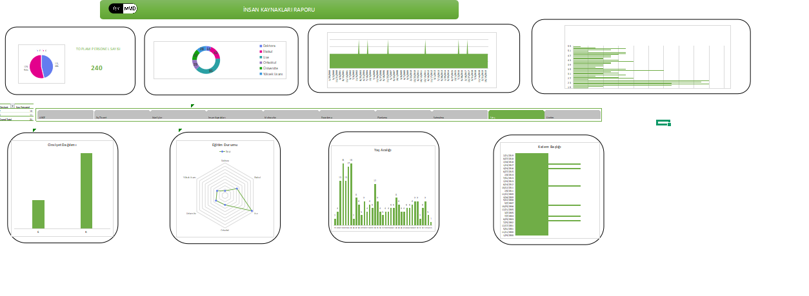

## Dashboard 

## HR Analytics Dashboard | İnsan Kaynakları Analitik Raporu

Bu proje, İnsan Kaynakları verilerinin Excel Pivot Table, Pivot Chart ve Slicer kullanılarak analiz edildiği profesyonel bir dashboard çalışmasını içerir.
Amacı, IK süreçlerinin hızlı ve dinamik şekilde izlenebileceği, formülsüz fakat güçlü bir analiz modeli göstermektir.

## Projenin Amacı

Bu çalışma, özellikle IK Raporlama, Veri Analizi ve Dashboard tasarımı alanlarında güçlü bir örnek oluşturmak için hazırlandı:

-İnsan kaynakları verilerini anlamlandırmak

-Etkileşimli bir dashboard tasarlamak

-Veri görselleştirme prensiplerini uygulamak

-Formül kullanmadan, Pivot mimarisi ile profesyonel bir raporlama oluşturmak

## Veri Seti Özeti

data sayfasındaki ham veri aşağıdaki alanları içerir:

-Personel bilgileri

-Cinsiyet

-Departman

-Eğitim seviyesi

-Doğum tarihi & yaş

-Çalışma tipi

-İşe giriş tarihi

## Dashboard Özellikleri
Pivot Tabanlı Analizler

Dashboard tamamen Pivot yapısı üzerine kuruldu:

-Departman bazlı çalışan dağılımı

-Cinsiyet analizi

-Yaş segmentasyonu

-Eğitim seviyeleri

-Çalışma tipi kırılımları

-İşe giriş yılı / kıdem analizi

##Teknik Yapı

Kullanılan Teknolojiler

-Microsoft Excel

-Pivot Table

-Pivot Chart

-Slicer

-Basit veri temizleme prensipleri

## Sıfır Formül — 100% Pivot Modeli

Bu dashboard tamamen Pivot mantığıyla oluşturulmuştur:

-Formül yok

-VBA yok

-Karmaşık fonksiyonlar yok

-Tamamen yenilenebilir: veri güncellendiğinde dashboard otomatik güncellenir

-İş analitiğine uygun, esnek yapı

## Nasıl Kullanılır

1-Dosyayı açın

2-Dashboard sayfasına girin

3-Sağdaki slicer’ları kullanarak filtreleme yapın

4-Veriyi güncellemek için:
Pivot Table → Sağ Tık → Refresh

## Tasarım Prensipleri

-Sadelik ve okunabilirlik

-Renklerin tutarlı kullanımı

-Gereksiz bilgi kalabalığının olmaması

-IK yöneticilerinin sıklıkla baktığı KPI’ların vurgulanması

-Dashboard’ın hızlı çalışması

-Veri ile grafiklerin doğru eşleşmesi

## English Version

This project presents a professional HR analytics dashboard created fully with Excel Pivot Tables, Pivot Charts, and Slicers — without using any formulas.
The goal is to provide a dynamic, interactive, and formula-free analytical model for HR processes.

## Project Purpose

This project is designed as a strong example in HR Reporting, Data Analysis, and Dashboard Design:

-Interpret HR data

-Create an interactive dashboard

-Apply data visualization principles

-Build professional reporting entirely with Pivot architecture, without formulas

## Dataset Overview

The raw data in the data sheet includes:

-Employee profile

-Gender

-Department

-Education level

-Date of birth & age

-Employment type

-Hiring date

## Dashboard Features

## Pivot-Based Analysis

The dashboard is fully built on Pivot structure:

-Employee distribution by department

-Gender analysis

-Age segmentation

-Education levels

-Employment type breakdowns

-Hiring year / tenure analysis

## Visual Pivot Chart Dashboard

-Bar, pie, column, and donut charts

-Clean & simple design

-Color-coordinated theme

-Suitable for executive presentations

## Interactive Filtering with Slicer

The dashboard user can filter dynamically with:

-Department

-Gender

-Education

-Employment type

## Technical Structure

Technologies Used

-Microsoft Excel

-Pivot Table

-Pivot Chart

-Slicer

-Basic data cleaning principles

## Zero Formulas — 100% Pivot Model

The dashboard is entirely pivot-based:

-No formulas

-No VBA

-No complex functions

-Fully refreshable: dashboard updates automatically when data changes

-Flexible structure suitable for business analytics

## How to Use

1-Open the file

2-Go to the Dashboard sheet

3-Use the slicers on the right to filter

4-To refresh the data:
Pivot Table → Right Click → Refresh

## Design Principles

-Simplicity and readability

-Consistent color usage

-No unnecessary clutter

-Highlight KPIs important to HR managers

-Dashboard runs smoothly

-Accurate match between data and charts

